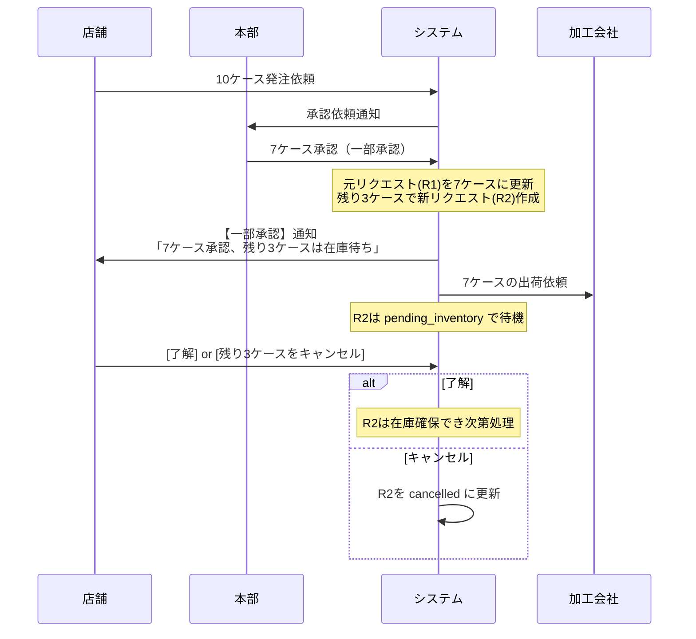
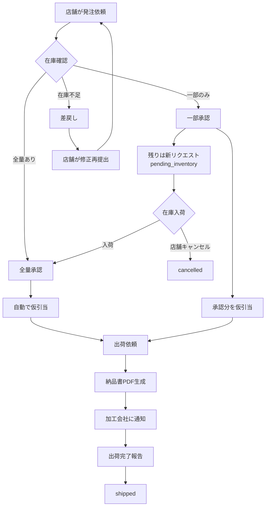

# 業務フロー

## 追加発注（店舗 → 本部）

### 店舗側（LINE）

1. **[在庫照会] または [追加発注] をタップ**
2. **商品選択**（クイックリプライで選択）
3. **数量入力**（ケース単位のみ、整数）
4. **希望納品日選択**
   - できるだけ早く
   - 日付指定
   - 特になし
5. **確認画面で [はい]**
6. **システムが受付**（status: `pending_approval`）

### 本部側（LINE or 管理画面）

7. **承認依頼通知を受信**（希望納品日順でソート）
8. **在庫を確認して以下のいずれかを選択**:

#### 全量承認
- → `approved`
- → 自動で在庫引当（`allocated_hold`）

#### 一部承認
- 承認数量を入力
- 元リクエストは承認数量で確定
- 残りは新規リクエスト（`pending_inventory`）として自動作成

#### 差戻し
- 理由入力
- → 店舗に通知（status: `rejected`）

## 在庫照会（店舗 → システム）

### 店舗側（LINE）

1. **[在庫照会] をタップ**
2. **商品選択**
3. **システムが在庫数量を回答**:

```
【在庫照会結果】
商品: ○○
在庫: 10ケース
※この情報は2時間前のものです

納品日は別途ご連絡します。
```

!!! note "納品日について"
    在庫数量のみリアルタイムで回答し、納品日は従来通り人が連絡します。

## 出荷依頼（本部 → 加工会社）

1. **本部承認**
   - → `shipment_requested` に自動遷移
2. **納品書PDF自動生成**
   - → Supabase Storage保存
3. **加工会社に通知**（通知方法は後日確定）
4. **加工会社が出荷完了報告**
   - → `shipped`

## 仮引当期限切れ

### 自動チェック
Cron（1時間毎）が `allocations.expires_at` をチェック

### 期限切れ発見時
- **店舗マネージャーにLINE通知**
  - 「まだ必要ですか？」
- **管理画面の「期限切れ一覧」に表示**
- **自動解放はしない**（Phase1では手動対応）

## 一部承認の詳細フロー

### シナリオ例
店舗が10ケース依頼、在庫は7ケースのみ

### システムの動作



### データの変化

**元のリクエスト（R1）**:
```sql
qty_requested: 10 → 7
approved_qty: 7
status: approved → allocated_hold
```

**新しいリクエスト（R2）**:
```sql
parent_request_id: R1
qty_requested: 3
status: pending_inventory
```

## フロー図まとめ


