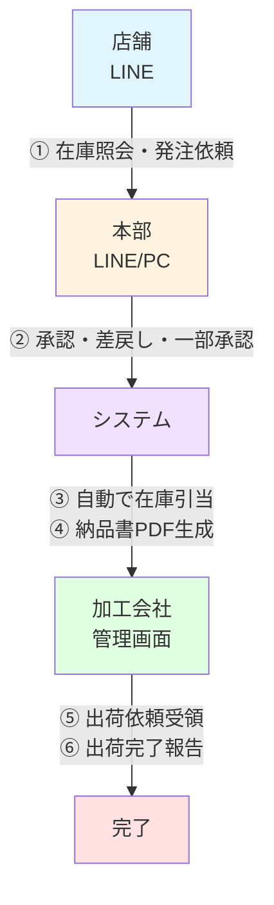

# 高島屋15店舗向け 追加発注・在庫照会システム
## システム概要書 v1.0

---

## 📱 システム概要

繁忙期における高島屋15店舗からの**突発的な追加発注対応を効率化**するLINEベースの自動化システムです。

### 解決する課題

| 現状の課題 | システム導入後 |
|-----------|--------------|
| 電話・メールでの在庫確認に時間がかかる | LINEで**即座に在庫確認**（3秒以内） |
| 本部・貴社・加工会社間で伝言ゲーム | システムで**一元管理**、情報の齟齬を削減 |
| 在庫の確度が不明確で事故リスク | **暫定/確定を明確化**、安全な在庫管理 |
| 納品書作成・管理が手作業 | **PDF自動生成**、クラウド保存 |

---

## 🎯 主要機能（3つの柱）

### 1️⃣ 在庫照会（店舗向け）
```
店舗マネージャーがLINEで即座に在庫確認
→「生チョコレート 10ケースありますか？」
→「在庫10ケースあります（※2時間前の情報）」
```

### 2️⃣ 追加発注・承認（店舗・本部）
```
店舗が発注 → 本部が承認 → 自動で在庫引当
【特徴】一部承認機能
依頼10ケース、在庫7ケースの場合
→ 7ケース承認、残り3ケースは在庫待ちとして自動管理
```

### 3️⃣ 出荷依頼・納品書（加工会社）
```
承認完了 → 納品書PDF自動生成 → 加工会社に通知
→ 出荷完了報告 → 店舗に通知
```

---

## 🔄 業務フロー



---

## 💡 特徴・メリット

### 🚀 スピード
- 在庫照会：**3秒以内**
- 発注受付：**5秒以内**
- 24時間365日対応

### 🎨 使いやすさ
- **LINEで完結**（新しいアプリ不要）
- 商品選択式（入力ミスなし）
- リッチメニューでワンタップ操作

### 🔒 安全性
- 在庫の確度管理（暫定/確定）
- 仮引当期限管理（24時間）
- 誰が承認したか記録

### 📊 効率化
- 納品書自動生成（手作業削減）
- Excel在庫の自動同期（5分毎）
- 伝言ゲーム削減

---

## 🛠 技術構成

| 項目 | 技術 | 備考 |
|------|------|------|
| フロント | LINE Official Account | 既存LINEアカウント活用可 |
| バックエンド | Python (FastAPI) | 高速・安定 |
| データベース | Supabase (PostgreSQL) | クラウド、自動バックアップ |
| ファイル | Supabase Storage | 納品書PDF保存 |
| 在庫入力 | Excel → 自動同期 | Phase1は手動アップロード |

---

## 📅 開発スケジュール

### Phase1（MVP）- 約2ヶ月

| 週 | タスク | 成果物 |
|----|--------|--------|
| 1-2 | 要件確定・設計 | データベース設計書 |
| 3-4 | LINE基本機能 | 在庫照会・追加発注 |
| 5 | 本部承認機能 | 承認・差戻し・一部承認 |
| 6 | Excel同期 | 自動同期処理 |
| 7 | 納品書生成 | PDF自動生成 |
| 8-9 | 統合テスト・調整 | 運用開始 |

### Phase2（精度向上）- 約1ヶ月
- 仮引当期限切れ自動解除
- Excel自動アップロード（Googleドライブ連携）
- 納品一覧の自動出力

### Phase3（最適化）- 約2ヶ月
- ロット/賞味期限最適化（FIFO）
- 納品日精度改善
- 本部承認の条件付き自動化

---

## 💰 導入効果（想定）

### 工数削減
- 在庫確認の電話対応：**80%削減**
- 納品書作成時間：**90%削減**
- 発注処理時間：**60%削減**

### ミス削減
- 在庫確認ミス：**ほぼゼロ**
- 伝達ミス：**大幅削減**

### 顧客満足度向上
- 迅速な在庫回答
- 正確な納品予定

---

## 📋 Phase1実装前の確認事項

以下の情報をご提供いただくとスムーズに開発を開始できます：

### 優先度：高（必須）

#### Excel関連
- [ ] **Excel列構成の確認**（商品名、ケース数、賞味期限等）
- [ ] **Excelサンプルファイルの入手**
- [ ] **商品名の表記ゆれの確認**

#### 納品書関連
- [ ] **納品書フォーマット**（既存のExcel/PDFテンプレート）
- [ ] **必須項目の確定**（商品名、数量、ロット番号等）
- [ ] **単価・金額の表示要否**

#### マスタデータ
- [ ] **商品マスタ**（商品一覧、ケースサイズ、SKU）
- [ ] **店舗マスタ**（15店舗の一覧、店舗コード）

### 優先度：中（仮決めで進行可能）

#### 通知関連
- [ ] 加工会社への出荷依頼通知方法（LINE/メール/管理画面）
- [ ] 管理者LINEグループの作成

#### 権限・セキュリティ
- [ ] 店舗マネージャー登録時の認証方法
- [ ] 本部バイヤーの招待コード管理フロー

---

## ✅ まとめ

### このシステムで実現すること

1. 店舗が**LINEで即座に在庫確認・発注**できる
2. 本部が**スマホでも承認**できる（外出先でもOK）
3. **在庫の確度を管理**し、事故を防ぐ
4. **納品書を自動生成**し、手作業を削減
5. まずは**Phase1で暫定運用**を開始、段階的に精度向上

### 次のステップ

1. 本提案書のご確認
2. 確認事項のご提供
3. 詳細仕様の最終確認
4. 開発開始

---

!!! success "推奨事項"
    Phase1は**暫定運用OK**の方針です。完璧を目指すより、まず動かして改善していくアプローチで進めます。

---

_Version: 1.0 | 作成日: 2026年2月15日_
