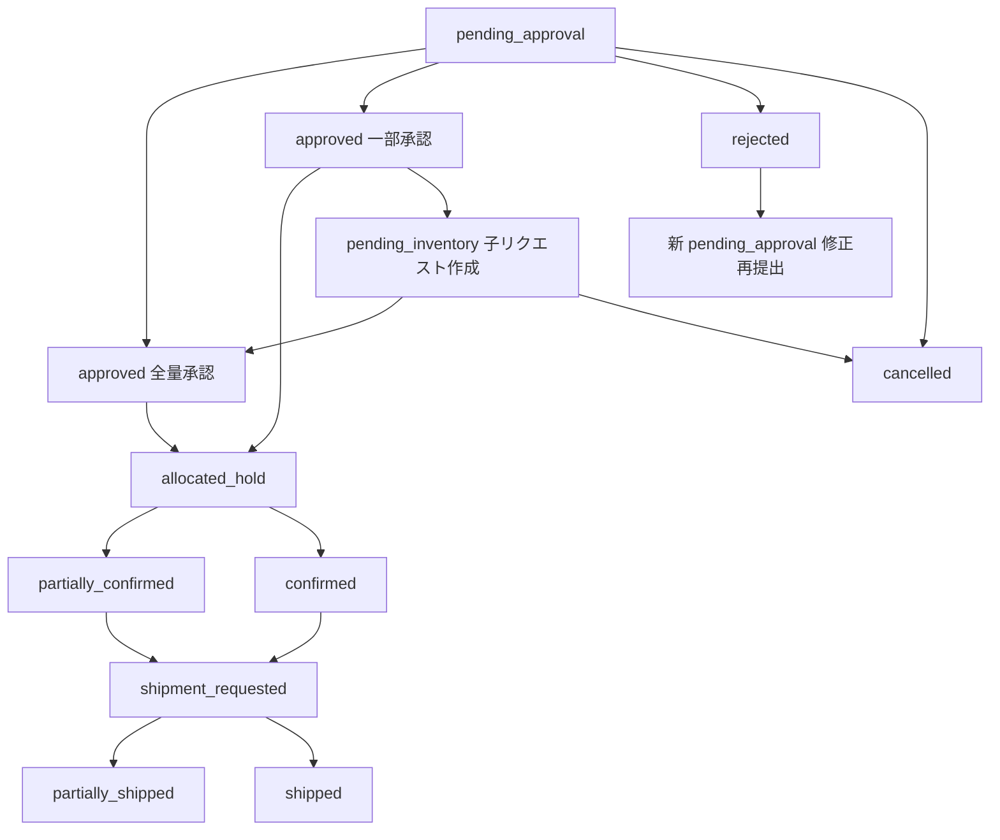

# データベース設計

全11テーブルで構成されます。

## マスタテーブル

### stores（店舗マスタ）

```sql
CREATE TABLE stores (
  id UUID PRIMARY KEY DEFAULT gen_random_uuid(),
  name TEXT NOT NULL,  -- 例: 高島屋新宿店
  code TEXT UNIQUE NOT NULL,  -- 店舗コード
  is_active BOOLEAN DEFAULT true,
  created_at TIMESTAMPTZ DEFAULT now(),
  updated_at TIMESTAMPTZ DEFAULT now()
);
```

### products（商品マスタ）

```sql
CREATE TABLE products (
  id UUID PRIMARY KEY DEFAULT gen_random_uuid(),
  name TEXT NOT NULL,
  sku TEXT UNIQUE,  -- SKUコード（任意）
  case_size INT NOT NULL,  -- 1ケースあたり個数
  is_active BOOLEAN DEFAULT true,
  created_at TIMESTAMPTZ DEFAULT now(),
  updated_at TIMESTAMPTZ DEFAULT now()
);
```

## ユーザー管理

### line_users（LINEユーザー）

```sql
CREATE TABLE line_users (
  id UUID PRIMARY KEY DEFAULT gen_random_uuid(),
  line_user_id TEXT UNIQUE NOT NULL,  -- LINE User ID
  display_name TEXT,
  store_id UUID REFERENCES stores(id),  -- store_managerのみ必須
  role TEXT NOT NULL,  -- 'store_manager' | 'buyer' | 'admin'
  supabase_auth_user_id UUID REFERENCES auth.users(id),  -- 将来の紐付け用
  is_active BOOLEAN DEFAULT true,
  created_at TIMESTAMPTZ DEFAULT now(),
  updated_at TIMESTAMPTZ DEFAULT now()
);
```

**制約**:
- `store_id` は `role='store_manager'` の場合のみ必須
- `role` は ENUM 型を推奨

### invitation_codes（招待コード）

```sql
CREATE TABLE invitation_codes (
  id UUID PRIMARY KEY DEFAULT gen_random_uuid(),
  code TEXT UNIQUE NOT NULL,  -- 招待コード
  role TEXT NOT NULL,  -- 'buyer' | 'admin'
  created_by UUID REFERENCES auth.users(id),
  used_by_line_user_id TEXT REFERENCES line_users(line_user_id),
  used_at TIMESTAMPTZ,
  expires_at TIMESTAMPTZ NOT NULL,
  is_active BOOLEAN DEFAULT true,
  created_at TIMESTAMPTZ DEFAULT now()
);
```

## 在庫管理

### inventory（在庫）

```sql
CREATE TABLE inventory (
  id UUID PRIMARY KEY DEFAULT gen_random_uuid(),
  product_id UUID NOT NULL REFERENCES products(id),
  lot_no TEXT,
  expiry_date DATE,
  qty_cases NUMERIC NOT NULL,
  status TEXT NOT NULL,  -- 'confirmed' | 'provisional'（Phase1では全てprovisional）
  updated_at TIMESTAMPTZ DEFAULT now(),
  source TEXT NOT NULL,  -- 'excel_sync' | 'admin' | 'factory'
  note TEXT
);
```

**Phase1運用**:
- 全て `status='provisional'` で運用
- `source='excel_sync'` が基本

### inventory_sync_log（在庫同期ログ）

```sql
CREATE TABLE inventory_sync_log (
  id UUID PRIMARY KEY DEFAULT gen_random_uuid(),
  sync_at TIMESTAMPTZ DEFAULT now(),
  file_last_modified TIMESTAMPTZ NOT NULL,  -- Excelファイルの更新タイムスタンプ
  file_path TEXT NOT NULL,  -- Storage内のパス
  records_imported INT NOT NULL,  -- 取り込んだ行数
  status TEXT NOT NULL,  -- 'success' | 'warning' | 'failed'
  error_message TEXT
);
```

## 発注管理

### requests（追加発注リクエスト）

```sql
CREATE TABLE requests (
  id UUID PRIMARY KEY DEFAULT gen_random_uuid(),
  store_id UUID NOT NULL REFERENCES stores(id),
  product_id UUID NOT NULL REFERENCES products(id),
  qty_requested NUMERIC NOT NULL,
  desired_date DATE,  -- 希望納品日（参考情報）
  status TEXT NOT NULL,  -- 下記のステータス一覧参照
  parent_request_id UUID REFERENCES requests(id),  -- 一部承認時の分割元
  approved_qty NUMERIC,  -- 一部承認時の実際の承認数量
  rejected_reason TEXT,  -- 差戻し理由
  error_message TEXT,  -- エラー内容
  error_at TIMESTAMPTZ,
  approved_by_line_user_id TEXT REFERENCES line_users(line_user_id),  -- LINE経由の承認
  approved_by_admin_id UUID REFERENCES auth.users(id),  -- 管理画面経由の承認
  approved_at TIMESTAMPTZ,
  created_by_line_user_id TEXT REFERENCES line_users(line_user_id),
  created_at TIMESTAMPTZ DEFAULT now(),
  updated_at TIMESTAMPTZ DEFAULT now()
);
```

#### ステータス一覧

| ステータス | 説明 |
|-----------|------|
| `pending_approval` | 店舗が依頼→本部承認待ち |
| `approved` | 本部承認済み |
| `allocated_hold` | 仮引当完了（全量） |
| `partially_confirmed` | 一部だけ確定引当 |
| `confirmed` | 全量確定引当 |
| `shipment_requested` | 出荷依頼済み |
| `partially_shipped` | 一部出荷完了 |
| `shipped` | 全量出荷完了 |
| `cancelled` | キャンセル |
| `rejected` | 差戻し |
| `pending_inventory` | 在庫待ち（分割された保留分） |

#### ステータス遷移図



### allocations（仮引当/確定引当）

```sql
CREATE TABLE allocations (
  id UUID PRIMARY KEY DEFAULT gen_random_uuid(),
  request_id UUID NOT NULL REFERENCES requests(id),
  inventory_id UUID NOT NULL REFERENCES inventory(id),
  qty_allocated NUMERIC NOT NULL,
  type TEXT NOT NULL,  -- 'hold' | 'confirmed'
  status TEXT NOT NULL,  -- 'active' | 'expired' | 'released' | 'shipped'
  expires_at TIMESTAMPTZ,  -- holdのみ、作成時刻 + 24時間
  confirmed_at TIMESTAMPTZ,
  created_at TIMESTAMPTZ DEFAULT now(),
  updated_at TIMESTAMPTZ DEFAULT now()
);
```

**運用ルール**:

- 承認時: `type='hold'`, `status='active'`, `expires_at=+24時間`
- 期限切れ時: `status='active'` のまま、警告のみ
- 手動解放: `status='released'`
- 確定: `type='confirmed'`, `confirmed_at=now()`
- 出荷完了: `status='shipped'`

## 出荷管理

### shipments（出荷）

```sql
CREATE TABLE shipments (
  id UUID PRIMARY KEY DEFAULT gen_random_uuid(),
  request_id UUID NOT NULL REFERENCES requests(id),
  ship_to_store_id UUID NOT NULL REFERENCES stores(id),
  tracking_number TEXT,
  status TEXT NOT NULL,  -- 'requested' | 'packed' | 'shipped' | 'delivered' | 'cancelled'
  shipped_at TIMESTAMPTZ,
  delivered_at TIMESTAMPTZ,
  note TEXT,  -- 納品日を手動記録する場合など
  created_at TIMESTAMPTZ DEFAULT now(),
  updated_at TIMESTAMPTZ DEFAULT now()
);
```

### documents（帳票）

```sql
CREATE TABLE documents (
  id UUID PRIMARY KEY DEFAULT gen_random_uuid(),
  request_id UUID NOT NULL REFERENCES requests(id),
  doc_type TEXT NOT NULL,  -- 'delivery_note'
  storage_bucket TEXT NOT NULL,  -- 'documents'
  storage_path TEXT NOT NULL,  -- 例: delivery_notes/2026/02/request_id_v1.pdf
  version INT NOT NULL DEFAULT 1,  -- 1, 2, 3...
  is_latest BOOLEAN DEFAULT true,  -- 最新版フラグ
  created_at TIMESTAMPTZ DEFAULT now(),
  created_by UUID REFERENCES auth.users(id)
);
```

## システム設定

### system_settings（システム設定）

```sql
CREATE TABLE system_settings (
  id UUID PRIMARY KEY DEFAULT gen_random_uuid(),
  key TEXT UNIQUE NOT NULL,
  value TEXT NOT NULL,
  description TEXT,
  updated_at TIMESTAMPTZ DEFAULT now()
);
```

**設定例**:

| key | value | description |
|-----|-------|-------------|
| `admin_notification_line_group_id` | `U1234...` | 管理者通知先LINEグループID |
| `inventory_storage_bucket` | `inventory` | 在庫Excel保存先bucket |
| `excel_staleness_warning_hours` | `2` | 在庫情報の古さ警告閾値 |
| `allocation_hold_hours` | `24` | 仮引当期限 |

## RLS（Row Level Security）

### 前提
- **LINEボット**: service role で全件アクセス（RLSバイパス）
- **管理画面**: Supabase Auth + RLS で制御

### RLSポリシー例

#### requests テーブル

```sql
-- 店舗マネージャー: 自店舗のみ閲覧
CREATE POLICY "store_manager_select_own"
  ON requests FOR SELECT
  USING (
    EXISTS (
      SELECT 1 FROM line_users
      WHERE line_users.supabase_auth_user_id = auth.uid()
        AND line_users.role = 'store_manager'
        AND requests.store_id = line_users.store_id
    )
  );

-- 本部バイヤー・管理者: 全件閲覧
CREATE POLICY "buyer_admin_select_all"
  ON requests FOR SELECT
  USING (
    EXISTS (
      SELECT 1 FROM line_users
      WHERE line_users.supabase_auth_user_id = auth.uid()
        AND line_users.role IN ('buyer', 'admin')
    )
  );
```

#### inventory テーブル

```sql
-- 本部バイヤー・管理者のみ閲覧可
CREATE POLICY "buyer_admin_select_inventory"
  ON inventory FOR SELECT
  USING (
    EXISTS (
      SELECT 1 FROM line_users
      WHERE line_users.supabase_auth_user_id = auth.uid()
        AND line_users.role IN ('buyer', 'admin')
    )
  );
```

## インデックス

パフォーマンス最適化のため、以下のインデックスを作成：

```sql
-- requests
CREATE INDEX idx_requests_status ON requests(status);
CREATE INDEX idx_requests_store_id ON requests(store_id);
CREATE INDEX idx_requests_created_at ON requests(created_at);

-- allocations
CREATE INDEX idx_allocations_request_id ON allocations(request_id);
CREATE INDEX idx_allocations_expires_at ON allocations(expires_at) WHERE type = 'hold';

-- inventory
CREATE INDEX idx_inventory_product_id ON inventory(product_id);
CREATE INDEX idx_inventory_status ON inventory(status);
```

## 初期データ

Phase1開始前に以下のマスタデータ投入が必要：

- [ ] stores（15店舗）
- [ ] products（商品一覧）
- [ ] system_settings（基本設定）
