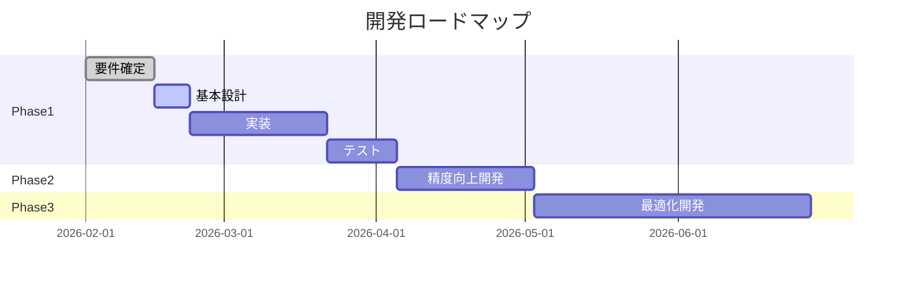

# フェーズ

## Phase1（MVP）

### 目標

**運用の回りやすさを最優先**

- まず動かす
- 暫定運用OK
- 精度はPhase2以降で向上

### 実装機能

- ✅ 追加発注（LINE）
- ✅ 在庫照会（数量のみ、納品日は別途連絡）
- ✅ 本部承認（全量/一部/差戻し）
- ✅ 一部承認時の自動分割
- ✅ 仮引当管理（24時間期限、警告のみ）
- ✅ 出荷依頼通知
- ✅ 納品書PDF生成 → Supabase Storage保存
- ✅ Excel手動アップロード + 自動同期
- ✅ requests/shipments/allocations ステータス管理
- ✅ LINE UI（リッチメニュー、クイックリプライ）

### 開発期間（想定）

- **要件確定**: 2週間
- **基本設計**: 1週間
- **実装**: 4週間
- **テスト**: 2週間
- **合計**: 約2ヶ月

### 開発優先順位

1. **データベース設計・構築**（Week 1-2）
   - テーブル作成
   - 初期データ投入
   - RLS設定

2. **LINE ボット基本機能**（Week 3-4）
   - 在庫照会
   - 追加発注
   - ユーザー登録

3. **本部承認機能**（Week 5）
   - 承認・差戻し・一部承認
   - 在庫引当

4. **Excel同期**（Week 6）
   - アップロード機能
   - 自動同期処理

5. **納品書PDF生成**（Week 7）
   - テンプレート作成
   - PDF生成ロジック

6. **統合テスト・調整**（Week 8-9）

---

## Phase2（精度向上）

### 目標

Phase1の運用実績を踏まえて精度を向上

### 実装機能

#### 仮引当期限切れ自動解除

- Cron で自動的に `status='expired'` に変更
- 在庫を自動解放

#### 商品名照合ミスのエラー管理強化

- 専用エラーテーブル（`inventory_import_errors`）
- ダッシュボードでエラー一覧表示
- 手動でマッピング修正

#### 納品一覧

- view + CSV export or Sheets連携
- 日次/週次で自動出力
- 店舗別・商品別の集計

#### Excel自動アップロード

- Googleドライブ連携
- Drive API で定期的にファイル取得
- 加工会社の運用を変えずに自動化

#### 在庫 status='confirmed' 管理の本格運用

- 加工会社が確定操作
- provisional → confirmed の承認フロー
- 確定在庫のみで引当（オプション）

### 開発期間（想定）

約1ヶ月

---

## Phase3（最適化）

### 目標

業務効率の最大化

### 実装機能

#### ロット/賞味期限最適化（FIFO）

- 賞味期限の近い在庫から自動引当
- ロット番号の追跡強化

#### 納品日精度改善

- 祝日カレンダー対応
- 店舗受入条件（火曜日は不可など）
- 配送業者の稼働日考慮

#### 本部承認の条件付き自動化

- 金額/数量閾値で自動承認
- 設定可能な承認ルール
- 例外は手動承認

#### ダッシュボード強化

- リアルタイムダッシュボード
- 在庫推移グラフ
- 発注傾向分析

#### API公開

- 外部システムとの連携
- REST API
- OpenAPI仕様書

### 開発期間（想定）

約2ヶ月

---

## ロードマップ

---

## フェーズ判断基準

### Phase1 → Phase2 への移行

以下の条件を満たしたら移行：

- [ ] 2週間以上の安定運用実績
- [ ] 重大なバグがゼロ
- [ ] ユーザーからの改善要望を整理
- [ ] Excel同期エラーが週1回以下

### Phase2 → Phase3 への移行

以下の条件を満たしたら移行：

- [ ] Phase2機能の安定運用（1ヶ月以上）
- [ ] 運用フローの定着
- [ ] 本部承認の自動化ニーズが明確
- [ ] 納品日精度の改善要求がある

---

## Phase1 完了判定基準

以下を全て満たしたらPhase1完了：

### 機能要件
- [x] 店舗がLINEで在庫照会できる
- [x] 店舗がLINEで追加発注できる
- [x] 本部がLINEまたは管理画面で承認できる
- [x] 一部承認が動作する
- [x] Excelアップロード→自動同期が動作する
- [x] 納品書PDFが自動生成される

### 非機能要件
- [x] 在庫照会が3秒以内にレスポンス
- [x] 重大なセキュリティ脆弱性がゼロ
- [x] エラー時に管理者に通知される

### 運用要件
- [x] 店舗マネージャー用マニュアル作成
- [x] 本部バイヤー用マニュアル作成
- [x] 管理者用運用手順書作成（簡易版）

---

## リスクと対策

### Phase1 のリスク

| リスク | 影響度 | 対策 |
|--------|--------|------|
| Excel列構成が確定しない | 高 | 早期にヒアリング実施 |
| 納品書フォーマット未確定 | 高 | テンプレート早期入手 |
| LINE API制限 | 中 | 公式ドキュメント確認、制限内で設計 |
| Supabase容量不足 | 低 | Proプラン検討 |

### Phase2 のリスク

| リスク | 影響度 | 対策 |
|--------|--------|------|
| Googleドライブ連携の権限問題 | 中 | 事前に権限設定確認 |
| 自動解除ロジックのバグ | 高 | 十分なテスト実施 |

### Phase3 のリスク

| リスク | 影響度 | 対策 |
|--------|--------|------|
| 祝日カレンダーの保守 | 低 | 外部APIまたはライブラリ活用 |
| 自動承認の誤動作 | 高 | 段階的導入、閾値調整 |
